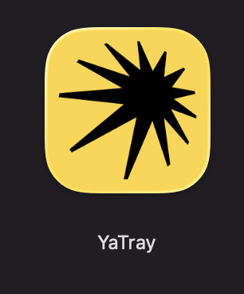
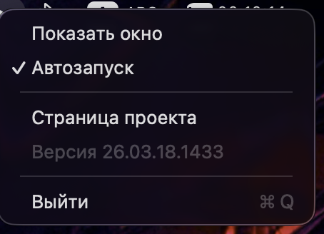
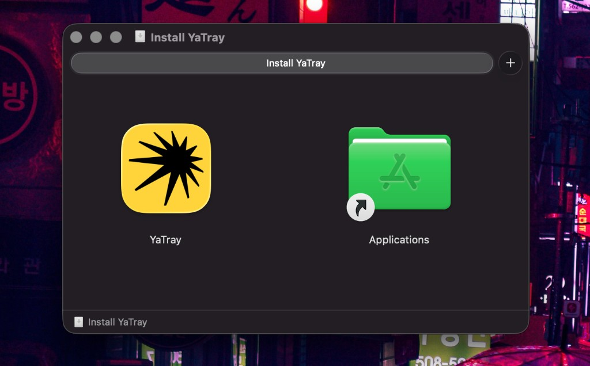

# YaTray

Маленькое приложение для macOS: иконка в меню-баре (трее), быстрый запуск **Яндекс Музыки** и перехват медиа-клавиши Play, чтобы по нажатию открывалась именно она, а не iTunes. Почти как iTunes в трее, только для Яндекса. Надеюсь, Яндекс не подаст на меня в суд.



---

## Что умеет

- **Иконка в меню-баре**: компактная иконка «плей» в стиле системных иконок macOS. Не занимает место в доке.
- **Левый клик** по иконке: показать или скрыть окно Яндекс Музыки (если приложение уже запущено).
- **Правый клик**: меню:
  - **Показать окно** / **Запустить Яндекс Музыку** в зависимости от того, запущена ли уже Музыка.
  - **Автозапуск**: включить или выключить запуск YaTray при входе в систему.
  - **Страница проекта**: открыть этот репозиторий в браузере.
  - **Версия**: номер сборки (год.месяц.день.часминута).
  - **Выйти**: закрыть YaTray (⌘Q).



- **Медиа-клавиша Play** на клавиатуре (или F8): если Яндекс Музыка не запущена, YaTray её запустит и «съест» событие, чтобы не открывался iTunes. Если уже запущена, просто выведет окно на передний план. Для этого нужно один раз выдать YaTray разрешение **«Управление компьютером»** (Accessibility) в Системных настройках.


---

## Зачем это нужно

Удобно держать доступ к Яндекс Музыке из трея и не искать приложение в доке. Плюс нажал Play на клавиатуре, открылась именно Музыка, а не что-то другое. Никакого лишнего функционала: только запуск, показ окна и автозапуск.

---

## Установка (готовая сборка)

1. Открой страницу релизов: **[Releases · lyucean/YaTray](https://github.com/lyucean/YaTray/releases)**.
2. Скачай последний релиз, файл **`YaTray-macOS-XXXXXXXX.dmg`** (в блоке Assets). Не качай «Source code», там исходники.
3. Открой скачанный DMG (двойной клик по файлу).
4. В открывшемся окне перетащи **YaTray** в папку **Программы** (Applications), как подсказывает стрелка.



5. Готово. YaTray появится в меню-баре после первого запуска (найди приложение в папке «Программы» и запусти).

**Важно:** на Mac должна быть установлена [Яндекс Музыка](https://music.yandex.ru/) из официального сайта (в папке «Программы»). YaTray только запускает это приложение и перехватывает Play, самого плеера внутри нет.

---

## Сборка из исходников

Если хочешь собрать приложение сам (например, чтобы поковырять код или не доверять готовому DMG):

### Что нужно

- **macOS** (желательно последняя версия).
- **Xcode** с поддержкой Swift (достаточно Command Line Tools, но проще с полным Xcode).
- Установленная **Яндекс Музыка** в `/Applications` (иначе приложение будет работать, но «Запустить Музыку» ничего не откроет).

### Шаги

1. Клонируй репозиторий:
   ```bash
   git clone https://github.com/lyucean/YaTray.git
   cd YaTray
   ```

2. Собери проект:
   ```bash
   make build
   ```
   Готовое приложение будет в `build/Build/Products/Release/YaTray.app`.

3. Запустить без установки:
   ```bash
   make run
   ```

4. Установить в папку «Программы»:
   ```bash
   make install
   ```

5. Создать DMG-установщик (как в релизах):
   ```bash
   make dmg
   ```
   Файл появится в папке `release/`.

Другие команды: `make help` покажет все доступные цели (clean, zip, release и т.д.).

---

## Ссылки

- **Релизы (скачать DMG):** [https://github.com/lyucean/YaTray/releases](https://github.com/lyucean/YaTray/releases)
- **Исходный код:** этот репозиторий

Приложение неофициальное, к Яндексу не имеет отношения. Логотип и название «Яндекс Музыка» принадлежат им.
